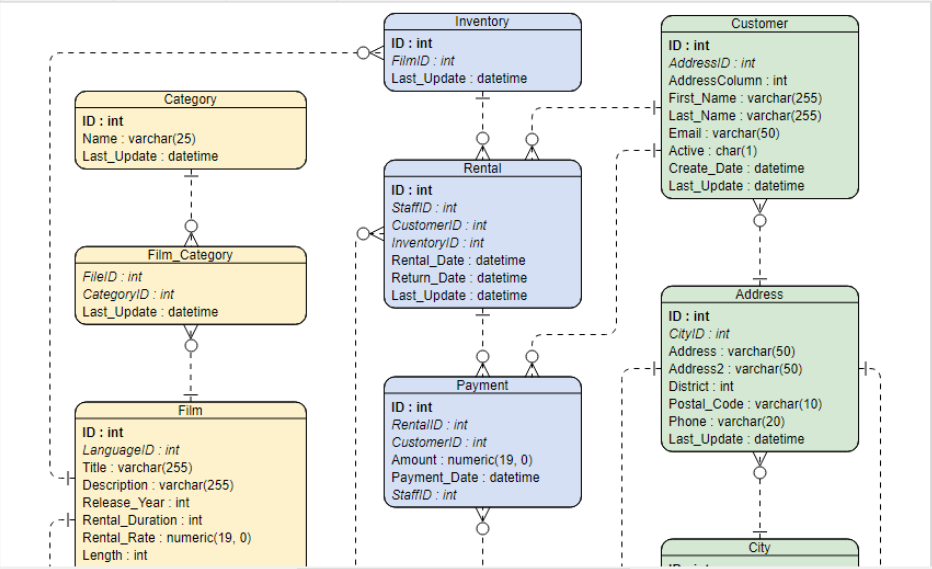
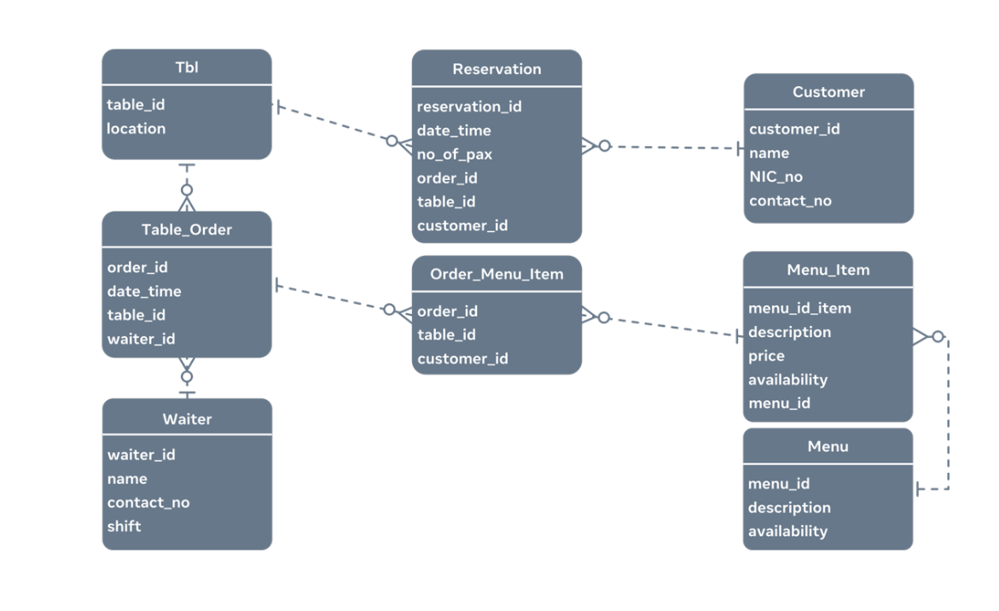

# SQL

# Indice

- [ER-D Entity Relationalship diagram](#er-d-entity-relationalship-diagram)
- [Estructura basica de una consulta SQL](#estructura-basica-de-una-consulta-sql)
  - [Crear una base de datos](#crear-una-base-de-datos)
  - [Crear una nueva tabla](#crear-una-nueva-tabla)
  - [Insertar datos en una tabla](#insertar-datos-en-una-tabla)
  - [Eliminar registros de una tabla](#eliminar-registros-de-una-tabla)
  - [Actualizar un registro de una tabla](#actualizar-un-registro-de-una-tabla)
- [Operadores logicos](#operadores-lógicos)
- [Esquema de bases de datos](#esquema-de-bases-de-datos)
- [Normalizacion de bases de datos](#normalizacion-de-bases-de-datos)
  - [Primera forma normal](#primera-forma-normal) 
  - [Segunda forma normal](#segunda-forma-normal)
  - [Tercera forma normal](#tercera-forma-normal)
- [PostgreSQL](#postgresql) 
  - [Comandos de navegacion y consulta](#comandos-de-navegación-y-consulta-de-información) 
  - [Comandos de inspeccion y ejecucion](#comandos-de-inspección-y-ejecución)
  - [Comandos para debug y optimizacion](#comandos-para-debug-y-optimización)

## ER-D Entity Relationalship Diagram:

Un diagrama entidad relación (también conocido como diagrama ER o diagrama ERD o 
simplemente ERD) muestra cómo interactúan las entidades (personas, objetos y conceptos). 
Estos modelos conceptuales de datos ayudan a desarrolladores y diseñadores a visualizar 
las relaciones entre elementos clave del software.

El diagrama en sí es un tipo de diagrama de flujo. Es un modelo lógico que muestra cómo 
fluyen los datos de una entidad a otra. Con este formato fácil de seguir, los desarrolladores 
y diseñadores de software pueden visualizar claramente la estructura de un sistema.

## Estructura basica de una consulta SQL:
    SELECT ColumnaUno, ColumnaDos ...
    FROM Nombre_Tabla 
    WHERE ColumnaUno = 'Condicion'
    ORDER BY ColumnaDos DESC
    ...
    ...;

## Crear una base de datos:
    CREATE DATABASE Nombre_Base_Datos;

## Crear una nueva tabla:
### 1. Seleccionar la base de datos: 
    USE Nombre_Base_Datos; 

### 2. Crear la tabla:
    CREATE TABLE Nombre_Tabla (Nombre_Columna TIPO_DATOS RESTRICCIONES FOREIGN KEY(Nombre_Columna ...));

## Insertar datos en una tabla:
    INSERT INTO Nombre_Tabla VALUES (Valor_ColumnaUno, Valor_ColumnaDos ...);

## Eliminar registros de una tabla:
    DELETE FROM nombre_de_la_tabla
    WHERE condición;

## Actualizar un registro de una tabla:
    UPDATE nombre_de_la_tabla
    SET columna1 = valor1,
    columna2 = valor2,
    ...
    columnaN = valorN
    WHERE condición;

## Operadores lógicos:

### ALL
Se utiliza para comparar un único valor con todos los valores de otro conjunto de valores.

### AND
Permite la existencia de varias condiciones en la cláusula WHERE de una indicación SQL.

### ANY
Se utiliza para comparar un valor con cualquier valor aplicable de la lista según la condición.

### BETWEEN
Se utiliza para buscar valores que estén dentro de un conjunto de valores, dado el valor mínimo y el valor máximo.

### EXISTS
Se utiliza para buscar la presencia de una fila en una tabla específica que cumpla con un criterio determinado.

### IN
Se utiliza para comparar un valor con una lista de valores literales que se hayan especificado.

### LIKE
Se utiliza para comparar un valor con valores similares por medio de operadores comodín.

### NOT
Invierte el significado del operador lógico con el que se utiliza. Por ejemplo: NOT EXISTS, NOT BETWEEN, NOT IN, etc. Este es un operador negativo.

### OR
Se utiliza para combinar varias condiciones en la cláusula WHERE de una indicación SQL.

### IS NULL
Se utiliza para comparar un valor con un valor NULL.

### UNIQUE
Busca la singularidad en cada fila de una tabla determinada (sin duplicados).

# Esquema de bases de datos:

Para crear la base de datos de un restaurante, la sintaxis SQL es la siguiente:

    CREATE DATABASE restaurant;

La primera tabla “tbl” representa una mesa del restaurante. Cuenta con un ID único y 
una ubicación, donde se ubica en el restaurante. El ID único es la clave principal de esta tabla.

    CREATE TABLE tbl (
        table_id INT,
        location VARCHAR(255),
        PRIMARY KEY (table_id) 
    ); 

La siguiente tabla contiene datos sobre los camareros que trabajan en el restaurante. Tienen un 
ID único, un nombre, su número de contacto y en qué turno suelen trabajar. La clave principal de 
la tabla es el ID único asignado al camarero.

    CREATE TABLE waiter(
        waiter_id INT,
        name VARCHAR(150),
        contact_no VARCHAR(10),
        shift VARCHAR(10),
        PRIMARY KEY (waiter_id)
    ); 

La siguiente sintaxis crea la tabla que almacena datos sobre pedidos para cada tabla. Tiene los 
campos ID del pedido y ID de la tabla. Además de un campo date_time para registrar la fecha y 
hora del pedido y el ID del camarero que se supone que debe servir esa mesa para ese pedido.

    CREATE TABLE table_order(
        order_id INT,
        date_time DATETIME,
        table_id INT,
        waiter_id INT,
        PRIMARY KEY (order_id),
        FOREIGN KEY (table_id) REFERENCES tbl(table_id),
        FOREIGN KEY (waiter_id) REFERENCES waiter(waiter_id)
    );

Esta tabla almacena datos sobre los clientes. Tiene un ID del cliente, nombre, número NIC para 
almacenar el número del documento nacional de identidad y los campos de número de contacto. La 
clave principal es el campo único ID del cliente.

    CREATE TABLE customer(
        customer_id INT,
        name VARCHAR(100),
        NIC_no VARCHAR(12),
        contact_no VARCHAR(10),
        PRIMARY KEY (customer_id)
    ); 

La tabla de reservas asocia un pedido con un cliente. Tiene un ID único, una fecha y hora, el 
número de invitados o pasajeros esperados, el order_id, table_id y el customer_id. Su clave 
principal es el ID de reserva único. Esta tabla se vincula con las tablas tbl, table_order y cliente.

    CREATE TABLE reservation(
        reservation_id INT,
        date_time DATETIME,
        no_of_pax INT,
        order_id INT,
        table_id INT,
        customer_id INT,
        PRIMARY KEY (reservation_id),
        FOREIGN KEY (order_id) REFERENCES table_order(table_id),
        FOREIGN KEY (table_id) REFERENCES tbl(table_id),
        FOREIGN KEY (customer_id) REFERENCES customer(customer_id)
    ); 

Esta tabla de menú almacena todos los menús del restaurante. Tiene un menu_id que es el campo único 
que contiene descripciones del menú y su disponibilidad.

    CREATE TABLE menu(
        menu_id INT,
        description VARCHAR(255),
        availability INT,
        PRIMARY KEY (menu_id)
    ); 

Cada menú puede tener elementos de menú únicos, y estos elementos se almacenan en el menú, en la tabla
menu_item. Los elementos del menú también tienen campos de descripción, precio y disponibilidad. Esta
tabla se vincula con la tabla de menú.

    CREATE TABLE menu_item(
        menu_item_id INT,
        description VARCHAR(255),
        price FLOAT,
        availability INT,
        menu_id INT,
        PRIMARY KEY (menu_item_id),
        FOREIGN KEY (menu_id) REFERENCES menu(menu_id)
    );

Esta última tabla recoge los elementos de menú solicitados para un pedido concreto. Tiene el order_id, 
menu_item_id y la cantidad solicitada. Tiene una clave principal compuesta de la combinación del campo 
id_pedido e id_elemento_menú, y está vinculada con las tablas pedido_mesa y elemento_menú.

    CREATE TABLE order_menu_item(
        order_id INT,
        menu_item_id INT,
        quantity INT,
        PRIMARY KEY (order_id,menu_item_id),
        FOREIGN KEY (order_id) REFERENCES table_order(order_id),
        FOREIGN KEY (menu_item_id) REFERENCES menu_item(menu_item_id)
    ); 

Estas sentencias CREATE TABLE elaboran todas las tablas de la base de datos de reservas. Es importante 
tener en cuenta la manera en la que se establecen las relaciones entre las tablas. Cada tabla se define 
con una clave principal y, a su vez, se convierte en la clave externa de la tabla relacionada.

# Normalizacion de bases de datos

El proceso de normalización pretende minimizar las duplicaciones de datos, evitar errores durante las 
modificaciones de datos y simplificar las consultas de datos desde la base de datos. Las tres formas 
fundamentales de normalización se conocen como:

    Primera forma normal (1NF)
    Segunda forma normal (2NF)
    Tercera forma normal (3NF)

#### Regla de atomicidad de los datos:
La regla de atomicidad de datos significa que solo puede haber un único valor
de instancia del atributo de columna en cualquier celda de la tabla.

## Primera forma normal:

  - Todos los atributos deben tener valores atomicos.
  - No deben existir registros duplicados.
  - No deben haber registros multivaluados.

Las columnas repetidas deben eliminarse y colocarse en tablas separadas.

## Segunda forma normal:
En la segunda forma normal, debe evitar cualquier relación de dependencia parcial entre datos. La 
dependencia parcial se refiere a tablas con una clave principal compuesta. Es decir, una clave que 
consta de una combinación de dos o más columnas, donde un valor de atributo no clave depende solo de 
una parte de la clave compuesta.

  - La base de datos ya debe estar en primera forma normal.
  - Todos los atributos no clave deben depender por completo de cualquier clave candidata.

## Tercera forma normal:
Para que una relación en una base de datos esté en la tercera forma normal, ya debe estar en la segunda 
forma normal (2NF). 

Además, no debe tener dependencia transitiva. Esto significa que cualquier atributo
que no sea clave de la tabla de cirugía puede no depender funcionalmente de otro atributo no clave en la 
misma tabla. 

# PostgreSQL
La consola en PostgreSQL es una herramienta muy potente para crear, administrar y depurar nuestra base de 
datos. podemos acceder a ella después de instalar PostgreSQL y haber seleccionado la opción de instalar
la consola junto a la base de datos.

PostgreSQL está más estrechamente acoplado al entorno UNIX que algunos otros sistemas de bases de datos,
utiliza las cuentas de usuario nativas para determinar quién se conecta a ella (de forma predeterminada). 
El programa que se ejecuta en la consola y que permite ejecutar consultas y comandos se llama psql, psql 
es la terminal interactiva para trabajar con PostgreSQL, es la interfaz de línea de comando o consola principal, 
así como PgAdmin es la interfaz gráfica de usuario principal de PostgreSQL.

## Comandos de navegación y consulta de información

    \c Saltar entre bases de datos

    \l Listar base de datos disponibles

    \dt Listar las tablas de la base de datos

    \d <nombre_tabla> Describir una tabla

    \dn Listar los esquemas de la base de datos actual

    \df Listar las funciones disponibles de la base de datos actual
    
    \dv Listar las vistas de la base de datos actual

    \du Listar los usuarios y sus roles de la base de datos actual

## Comandos de inspección y ejecución

    \g Volver a ejecutar el comando ejecutando justo antes

    \s Ver el historial de comandos ejecutados

    \s <nombre_archivo> Si se quiere guardar la lista de comandos ejecutados en un archivo de texto plano

    \i <nombre_archivo> Ejecutar los comandos desde un archivo

    \e Permite abrir un editor de texto plano, escribir comandos y ejecutar en lote. \e abre el editor de texto, escribir allí todos los comandos, luego guardar los cambios y cerrar, al cerrar se ejecutarán todos los comandos guardados.

    \ef Equivalente al comando anterior pero permite editar también funciones en PostgreSQL

## Comandos para debug y optimización

    \timing Activar / Desactivar el contador de tiempo por consulta

## Comandos para cerrar la consola

    \q Cerrar la consola

